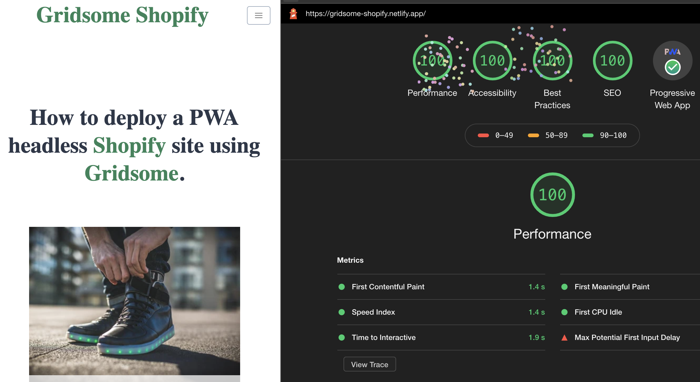

[](https://app.netlify.com/sites/gridsome-shopify/deploys)

# Shopify PWA starter for Gridsome

This is a boilerplate starter, optmized to reach the highest scores on Google Lighthouse, aiming to showcase how Gridsome and Shopify can work together, to create an amazingly fast shopping experience for consumers. [View Demo](https://gridsome-shopify.netlify.com)



## Features

- 4 x 100% Highest Scores on Google Lighthouse!
- Full SSR (Server Side Redenring) Static Site
- Progressive Web App (PWA) with "Add to Home Screen" button.
- Connected to Shopify backend
- Home Page showing Featured Products
- Product Search
- Product Page
- Collection Search
- All Collections Page
- TailwindCSS with PurgeCSS to remove unused css.
- SEO optimized
- Sitemap

## Shopify Setup

You will need to create a private app in Shopify, and give it access to the Storefront API - the default permissions should be fine for this starter.
Make sure to note the Storefront API key, and your store name.

## Installation

Install the Gridsome CLI.

```bash
npm install -g @gridsome/cli # or
yarn global add @gridsome/cli
```

## Create Project

You can either directly download this repository, or use Gridsome's CLI to download and install dependencies for you.

```bash
# Clone repository
git clone https://github.com/jsappme/gridsome-shopify-starter.git
npm install # or
yarn install

# Download with CLI
gridsome create my-gridsome-site jsappme/gridsome-shopify-starter
```

## Developing

You will need to add your Storefront API shop name (https://\<shop-name\>.myshopify.com) & token to an env file before running this starter.
I also recommend you add some collections in Shopify to best show off this starter.

```
# Note env's are prefixed with GRIDSOME_ to make them available to apollo client side
GRIDSOME_SHOPIFY_STOREFRONT=<shop name>
GRIDSOME_SHOPIFY_STOREFRONT_TOKEN=<storefront token>
```

Or you can manually edit the [Shopify Source Plugin's](https://gridsome.org/plugins/gridsome-source-shopify) configurations in `gridsome.config.js`.

Enter the site folder, and run `gridsome develop` to start a local development server.

Happy coding!

[Gridsome Shopify = ❤️](https://gridsomify.com)
